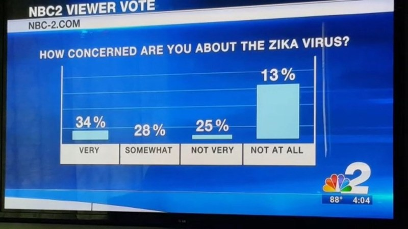
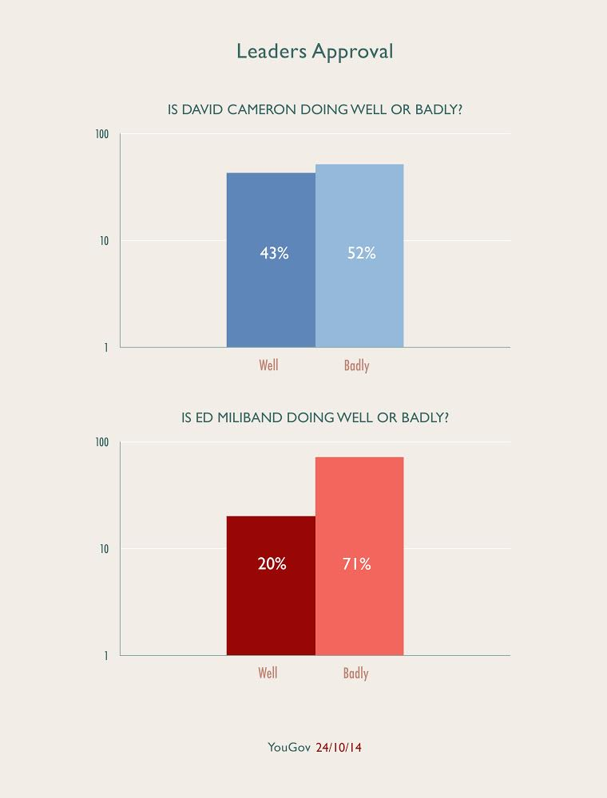
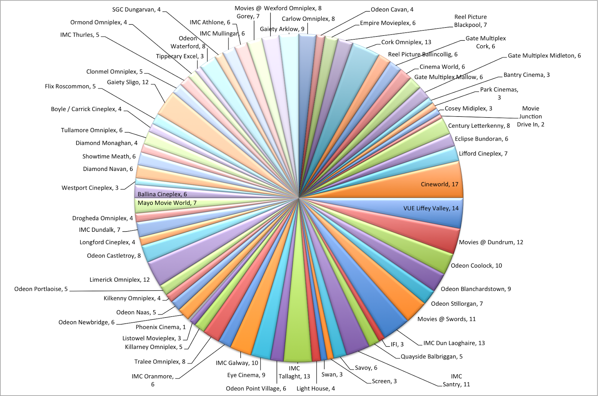
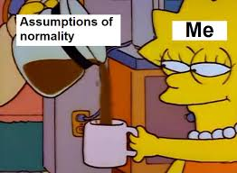
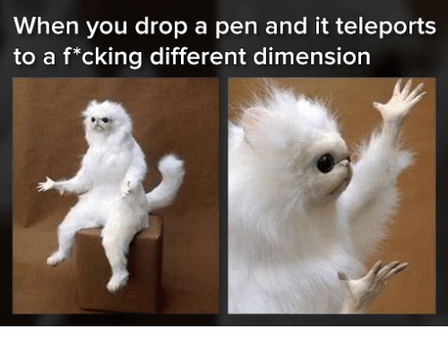
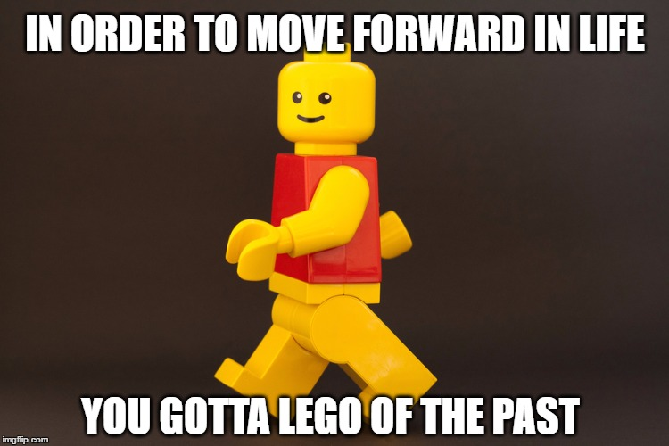

<style>
.forceBreak { -webkit-column-break-after: always; break-after: column; }
</style>

```{r generate fake data, echo = FALSE, message = FALSE, warning = FALSE}

library(tidyverse)
library(cowplot)

theme_set(theme_bw())

set.seed(123456)
A1 <- rnorm(50, 20, 2)
A2 <- rnorm(50, 10, 2)
A <- c(A1, A2)
B <- rnorm(100, 20, 2)

my_data <- tibble(A, B) %>%
  gather('Group', 'Outcome', A, B) %>%
  mutate(ID = 1:200,
         Treatment = rep(c('Yes', 'No', 'Yes', 'No'), each = 50),
         Age = rep(c('Younger', 'Older', 'Older', 'Younger'), each = 50)) %>%
  select(ID, Age, Group, Treatment, Outcome)

```

# Not every plot is a great plot... 

##

```{r bad_graph1, echo = FALSE, out.width= "700 px", fig.align='center'}



```

## 

```{r bad_graph2, echo = FALSE, out.width= "400 px", fig.align = "center"}



```

##

```{r bad_graph3, echo = FALSE, out.width= "700 px", fig.align = "center"}



```

# Why do we visualize data?

## Three key reasons for visualizing data

- Exploratory data analysis
- Checking assumptions
- Communicating results

```{r datavis, echo = FALSE, out.width= "400 px", fig.align='center'}


```

## Exploratory data analysis (EDA)

- It's useful to know how our data looks like before we analyze it
- Can help us avoid potential pitfalls and generate new hypotheses (for future experiments)
- “There is NO question of teaching exploratory OR confirmatory [analysis] – we need to teach both!” (Tukey, 1980)

## Checking assumptions

- After we fit a statistical model, it's always a good idea to visualize the residuals to check whether our assumptions have been met
- Normality: are our residuals normally distributed?
- Homoscedasticity: is the variance constant across the range of predicted values?


```{r normality, echo = FALSE, out.width= "350 px", fig.align='center'}



```

## Communicating results

- If we get exciting results, we want to effectively communicate them with other people
 (and impress journal editors)!

``` {r success, echo = FALSE, out.width = "500 px", fig.align = "center"}


  
```

# Plot trivia

##

```{r trivia_boxplot_barplot, echo = FALSE, fig.align = "center"}

boxplot1 <- ggplot(my_data, aes(Group, Outcome, fill = Group)) +
  geom_boxplot() +
  guides(fill = FALSE)

barplot1 <- ggplot(my_data, aes(Group, Outcome, fill = Group)) +
  geom_bar(stat = 'summary', fun.y = 'mean') +
  geom_errorbar(stat = 'summary', fun.data = 'mean_se', width = 0.2) +
  scale_y_continuous(limits = c(0, 26)) +
  guides(fill = FALSE)

plot_grid(boxplot1, NULL, barplot1, rel_widths = c(1, 0.1, 1), nrow = 1)

```

##

``` {r trivia_catterplot_violinplot, echo = FALSE, fig.align = "center"}

scatterplot1 <- ggplot(my_data, aes(Group, Outcome, col = Group)) +
  geom_jitter(height = 0, width = 0.1) +
  guides(col = FALSE)

violinplot1 <-   ggplot(my_data, aes(Group, Outcome, fill = Group)) +
  geom_violin(trim = FALSE, col = NA) +
  guides(fill = FALSE)

plot_grid(scatterplot1, NULL, violinplot1, rel_widths = c(1, 0.1, 1), nrow = 1)

```

## The plots were all displaying the same data!

```{r galaxy_brain, echo = FALSE, out.width= "400 px", fig.align = "center"}

knitr::include_graphics('pictures/galaxy.gif')

```


## All the plots on top of each other

```{r all plots, echo = FALSE}

ggplot(my_data, aes(Group, Outcome)) +
  geom_jitter(aes(col = Group), height = 0, width = 0.1) +
  geom_boxplot(aes(fill = Group), alpha = 0.5) +
  geom_violin(aes(fill = Group), col = NA, trim = FALSE, alpha = 0.5) +
  geom_bar(aes(fill = Group), stat = 'summary', fun.y = 'mean', alpha = 0.5) +
  geom_errorbar(stat = 'summary', fun.data = 'mean_se', width = 0.2, alpha = 0.5) +
  guides(fill = FALSE, col = FALSE)

```

## The data used to generate the plots

``` {r my_data, echo = FALSE}
knitr::kable(sample_n(my_data, 6))
```

## Same data, different  plots

- We can display the same data in different ways
- Different looking plots can have things in common
  - (x-axis, y-axis, colors to identify levels of a variable, data)
  
```{r boxplot_violinplot, echo = FALSE}

plot_grid(boxplot1, violinplot1, scale = 0.7, nrow = 1)

```

# Ggplot2

## Ggplot2 and the grammar of graphics {.columns-2}

- `ggplot2` is an R package developed by Hadley Wickham
- It provides a universal "grammar" for making plots
- It is also built around the idea that different looking plots can have things in common  

<p class="forceBreak"></p>

```{r wickham, echo = FALSE, out.width= "350 px", fig.align = "center"}


```

## How ggplot2 works

- Every plot in ggplot2 is composed of three basic components:
  - Data: the information we want to display in the graph
  - Aesthetics: the scales we want to map our data on to
  - Geoms: the geometric objects we want to represent our data with
- Any plot can be made by specifying these components!

## How to make a ggplot2 plot


``` {r ggplot2 function, eval = FALSE}

ggplot(data = ... , aes(x = ... , y = ...)) +
  geom_ ...

```

- Data: specify the data you want to plot
- Aes(thetics): specify what variables you want to put on the x-axis, y-axis, colour, etc...
- Geom(etric object): specify what geometric object(s) you want the data represented in
- That's it!


## Example 1: Make a boxplot {.build}

- We first specify the data, then we specify the x and y axis, and last we specify the geom

``` {r boxplot_plain, out.height = "300 px"}
ggplot(data = my_data, aes(x = Group, y = Outcome)) +
  geom_boxplot()
```

## Example 2: Make a violinplot {.build}

- To make a violin plot, we can just swap the geom:

``` {r violinplot_plain, out.height = "300 px"}
ggplot(data = my_data, aes(x = Group, y = Outcome)) +
  geom_violin(trim = FALSE)
```


## It's a little bit like Lego {.flexbox .vcenter}

```{r lego, echo = FALSE, out.width= "700 px"}


```


## Example 3: Make a scatterplot {.build}

- ...and we can do the same for a categorical scatterplot! (I used geom_jitter so that the points do not overlap)

``` {r scatterplot_plain, out.height = "300 px"}
ggplot(data = my_data, aes(x = Group, y = Outcome)) +
  geom_jitter(height = 0, width = 0.1)
```

## Enough with boring plots - what if we want some color?

> - Colour and fill of geoms can be defined as aesthetics in the same way that x and y axis are
> - This is useful if we have a 3rd variable from our data that we want to show
> - Or we just want to make our plot prettier

## Example 4: Redundant fill {.build}

- To distinguish our geoms by fill, we simply need to assign a variable to fill aesthetic:

``` {r boxplot_filled_redundant, out.height = "300 px"}
ggplot(data = my_data, aes(x = Group, y = Outcome, fill = Group)) +
  geom_boxplot()
```

## Example 5: Redundant colour {.build}

- We can do the same with colour (for 2D geoms like boxplot, colour describes the outline of the geom)

``` {r boxplot_coloured_redundant, out.height = "300 px"}
ggplot(data = my_data, aes(x = Group, y = Outcome, colour = Group)) +
  geom_boxplot()
```

## Example 6: Redundant colour for 1D geoms {.build}

- 1D geoms like points or lines do not have fill, only colour

``` {r scatterplot_coloured_redundant, out.height = "300 px"}
ggplot(data = my_data, aes(x = Group, y = Outcome, colour = Group)) +
  geom_jitter(height = 0, width = 0.1)
```

## Example 7: Extra colour variable {.build}

- We can also make colour represent a meaningful third variable like so:

``` {r scatterplot_coloured_meaningful, out.height = "300 px"}
ggplot(data = my_data, aes(x = Group, y = Outcome, colour = Age)) +
  geom_jitter(height = 0, width = 0.1)
```

## Example 8: Extra fill variable {.build}

- We can use fill to add an extra information to our plot, just like colour!

``` {r boxplot_fill_meaningful, out.height = "300 px"}
ggplot(data = my_data, aes(x = Group, y = Outcome, fill = Age)) +
  geom_boxplot()
```

## Beyond two dimensions...

- We can use aesthetics such as colour, fill, linetype, size, etc... to represent additional variables in our 2D plots
- We can think of it as adding extra dimensions to our plot! 

```{r pen_dimensions, echo = FALSE, out.width= "400 px", fig.align = "center"}



```

## Remember how I said ggplot2 is like lego?

```{r lego_of_past, echo = FALSE, out.width= "600 px", fig.align = "center"}



```

## Example 9: Beyond one geom {.build}

- We can also stack multiple geoms on top of each other like lego bricks:

``` {r overlayed_boxplot, out.height = "250 px"}
ggplot(data = my_data, aes(x = Group, y = Outcome, 
                           fill = Group, colour = Group)) +
  geom_jitter(height = 0, width = 0.1) +
  geom_boxplot(alpha = 0.5, colour = 'black')
```

## Stacking geoms

> - Stacking geoms is a powerful way to display complex information!
> - For example, you can have one geom represent your actual observed data (e.g. points for data points) and another geom to represent summary statistics (e.g. boxplot displays median, interquartile range, and outliers)
> - If you fit a statistical model to your data (e.g. a linear regression), you can stack it on top of your data points too!

## How to change the axis labels? {.build .smaller}

> - Ggplot2 automatically uses the names of the variables you specify in aesthetics as the axis labels
> - You can change these via the `labs()` argument:

``` {r boxplot_bestplot, out.height = "250 px", out.width = "400 px", fig.align = "center"}
ggplot(data = my_data, aes(x = Group, y = Outcome, 
                           fill = Group, colour = Group)) +
  geom_jitter(height = 0, width = 0.1) +
  geom_boxplot(alpha = 0.5, colour = 'black') +
  labs(title = 'This is objectively the best plot', 
       x = 'Some letters', y = 'How much you should love this plot')

```


## How to change axis limits, breaks? {.build .smaller}

> - Ggplot2 automatically picks what it thinks are the most useful axis limits & breaks
> - You need can add a `scale` argument to change these:

``` {r boxplot_axislims, out.height = "250 px", out.width = "400 px", fig.align = "center"}
ggplot(data = my_data, aes(x = Group, y = Outcome, 
                           fill = Group, colour = Group)) +
  geom_jitter(height = 0, width = 0.1) +
  geom_boxplot(alpha = 0.5, colour = 'black') +
  scale_y_continuous(limits = c(0, 50), breaks = seq(0, 50, by = 5))
```


## Why hasn't this guy received any love yet?

```{r dynamiteplot, echo = FALSE, warning = FALSE}

barplot1

```

## Bar plots are evil!

- Many statisticians and data vis experts strongly advocate AGAINST the use of bar plots (aka "dynamite plots")
- ggplot2 does not have a default plot for making bar plots (although you can still make them, as you can see)

```{r skeletor, echo = FALSE, out.width= "350 px", fig.align = "center"}


```

## Why are bar/dynamite plots evil? {.build}

- Dynamite plots look like they show more information than they really do:

```{r dynamite_vs_pointrange, echo = FALSE, warning = FALSE, fig.align = "center", out.height = "300 px"}

pointrange1 <- ggplot(my_data, aes(Group, Outcome, col = Group)) +
  geom_errorbar(stat = 'summary', fun.data = 'mean_se', col = 'black', width = 0.2) +    geom_point(stat = 'summary', fun.y = 'mean') +
  scale_y_continuous(limits = c(0, 26)) +
  guides(col = FALSE) +
  theme_bw()

plot_grid(barplot1, NULL, pointrange1, rel_widths = c(1, 0.1, 1), nrow = 1)

```

- The area of the bar graph doesn't represent any meaningful information - it's just wasting ink!

## Bar plots also hide unequal distributions of data

```{r dynamite_vs_scatterplot, echo = FALSE, warning = FALSE, fig.align = "center", out.height = "400 px"}

plot_grid(barplot1, NULL, scatterplot1, rel_widths = c(1, 0.1, 1), nrow = 1)

```

## So what are bar plots good for? {.build} 


``` {r fruit, echo = FALSE, fig.align = "center", out.height = "300 px", out.width = "500 px"}

library(tidyverse)
fruit_data <- tibble(fruit = rep(c('apple', 'banana', 'orange'), c(5, 2, 4)))

ggplot(fruit_data, aes(x = fruit, fill = fruit)) +
  geom_bar() +
  labs(title = 'How many of each type of fruit do I have in the bowl?')

```

- Bar plots were designed to show counts of discrete data
- That's it!
- For everything else, use boxplots, scatterplots, kernel density estimates, etc... 

# So what **should** we do?

## Principles of graphical excellence (Tufte, 2001)

> - Graphical excellence is the well-designed presentation of interesting data - a matter of *substance*, *statistics*, and *design*
> - Graphical excellence consists of complex ideas communicated with clarity, precision, and efficiency
> - **Graphical excellence is that which gives to the viewer the greatest number of ideas in the shortest time with the least in on the smallest space**
> - Graphical excellence is nearly always multivariate
> - And graphical excellence requires telling truth about the data

## Principles for making good plots

> - Keep it simple, less is more
> - Show your data, not just summaries (whenever possible)
> - Show uncertainty, not just your model
> - Find the right geoms to represent your information (e.g. boxplots for grouped continuous data, line plots for time-series,...)

## To summarize:

> - You can show the same data in different ways
> - Some ways of showing the data are better than others (boxplots > dynamite plots)
> - ggplot2 allows you to easily switch between different ways of plotting the same data and build your plots piece by piece like lego

## Congratulations! You are now a ggplot2 expert!

```{r ggplot_meme, echo = FALSE, out.width="500 px", fig.align="center"}

knitr::include_graphics('pictures/world.jpg')

library(help = "datasets")

```

## Time to plot

> - You can now go and make some ggplot2 plots of your own!
> - There are multiple pre-loaded datasets that you can explore & visualize. The handout uses the `diamonds` dataset, other good options are `mtcars`, `iris`, & `starwars` datasets.  
> - To see what variables are included in a dataset, use either the `str()` or `glimpse()` function.
> - For more info, see the handout. If you've brought your own data, yell at me and I'll come help you load it into R.
> - Happy plotting!
      


